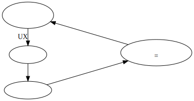
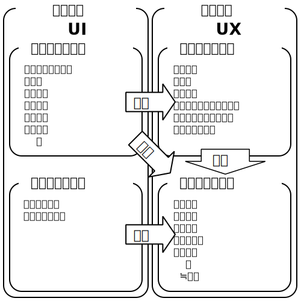

UXカーブを用いた
クチコミ支援ソフトウェアの実装

情報コース
久野公瑛

<time datetime="2019-12-07">2019/12/07</time>

---

研究テーマの補足

1. **UXカーブ**というUX評価の手法を**応用**して
2. ユーザの**クチコミ**の記述を**支援**する
3. **ソフトウェア**を**実装**した
    （＝有効性の評価はできなかった）

---

元来のクチコミ

> うわさ・評判などを口伝えに広めること。
> 
> [補説]マスコミをもじった語。
> 1960年代の初めに使われだした。

<small>出典：[goo国語辞書「口コミ」の項目](https://dictionary.goo.ne.jp/word/%E5%8F%A3%E3%82%B3%E3%83%9F/)</small>

---

本研究におけるクチコミ

- SNS
- ブログ
- ショッピングサイト

オンラインでの商品（製品・サービス）に関するクチコミを指す

---

クチコミの例

> 喜んでくれました
> :star::star::star::star::star:
> 父の誕生日プレゼントに購入しましたが、使いやすいと好評です。
> カラーは赤を選びましたが光沢感があり綺麗です。説明書を読まなくても使い方が分かる程度には機能
> がシンプル…

---

なぜクチコミの記述に支援が必要か

有用なクチコミを読めば
効率的に商品が評価できる

---

クチコミの有用性に関する分析

1. クチコミには主観的な表現が用いられる傾向
2. 主観的な表現が多いクチコミは有用性が低い

主観的な表現に偏ったクチコミでは、
効率的に商品を評価することができない

クチコミから評価できる商品の要素とは？

<small>参考：[商品レビュー文における主観的表現と有用性に関する検討](https://ipsj.ixsq.nii.ac.jp/ej/?action=repository_uri&item_id=164274&file_id=1&file_no=1)</small>

---

商品の品質は 4つに分類できる
{: style="position: absolute; top: 250px; width: 400px;"}

{: style="margin-left: 400px; height: 500px;"}

<small>参考：[第1回利用時品質検討WG 参考資料1 利用時品質とその評価](https://www.ipa.go.jp/files/000054772.pdf)</small>

---

まとめると

1. 客観的設計品質：利用前から商品がもつ特性

2. 客観的利用品質：
    どのように利用して
    どのような結果が得られたか

3. 主観的利用品質： 1\.と2\.を通してどう感じたか
    ≒主観的な表現

- 1\.と2\.が分かるクチコミの有用性は高いと
    考えられる
- 2\.と3\.はUXに相当する

---

UXとは

- **U**ser e**X**perience、ユーザ体験
- 一般的な概念としての経験の中でも、
    システムを通じた経験のこと
- 次のようなものに影響をうける
    - システムの特性
        → 客観的設計品質
    - ユーザとシステムを取り巻く文脈
        → 利用状況への適合性
    - ユーザの状態
        → ユーザ特性への適合性

<small>参考：[UX白書(日本語版)](http://site.hcdvalue.org/docs)</small>

---

商品を利用している 瞬間以外も UXは形成されている
{: style="position: absolute; top: 200px; width: 500px;"}

{: style="margin-left: 500px; height: 500px;"}

<small>出典：[UX白書(日本語版)](http://site.hcdvalue.org/docs)</small>

---

利用期間ごとに形成されるUXの性質は異なる

<small>出典：[UX白書(日本語版)](http://site.hcdvalue.org/docs)</small>

---

UXにおいて、エピソードが発生した
時間的順序と期間は重要

- **いつ**どんな利用をしたのか
- **いつ**なにを感じたのか

UXの評価手法においても同様

---

UXカーブとは

横軸に時間、縦軸に魅力、使いやすさなどの
度合いをペンで描くことでUXを評価する

{: style="height: 300px;"}

<small>参考・出典：[UX Curve: A method for evaluating long-term user experience](https://doi.org/10.1016/j.intcom.2011.06.005)</small>

---

UXカーブの特徴

- 思い出しながら書くので、1回の入力で
    利用期間全体のUXが記述できる
- 利用した時期に意識を向けることができる
- 時系列の順序でUXが整理できる

---

UXカーブを応用してクチコミを記述する意義

1. いつどのように利用して
    どのような結果が得られたか
    （≒客観的利用品質）
2. 1.に感情の推移がどのように対応するのか
    （≒主観的利用品質）

が分かるクチコミになる

---

類似したオンラインツールがある

<video controls src="images/ux-graph-tool-demo.mp4" />{: style="height: 500px"}

<small>[UXグラフツール - UX評価 （インタビュー）サポートツール](https://ux-graph.com/uxgraph/)</small>

---

実装したもの

<video controls src="images/ux-curve-generator-demo.mp4" />{: style="height: 500px"}

<small>[UXカーブジェネレーター](https://ux-curve-generator.netlify.com)</small>

---

UXグラフツールとの違い

- UXカーブが変化するのをみながら
    エピソードを入力する
- エピソードの日時を他のエピソードの
    相対的な時間で入力できる
- 調査設計者が調査参加者に入力させるのでなく
    ユーザが自身のために入力する
- 入力したUXカーブは任意のウェブページに
    埋め込むことができる

---

埋め込み例

<iframe src="images/example.html" />{: style="width: 400px; height: 500px;"}

---

今後の課題と展望

- 本ソフトウェアの有効性を検証する必要がある
    - 自由記述との比較
    - UXグラフツールとの比較
- 本ソフトウェアで作成したデータの
    テキストマイニングによる分析
- 複数のUXカーブを入力できるようにする
