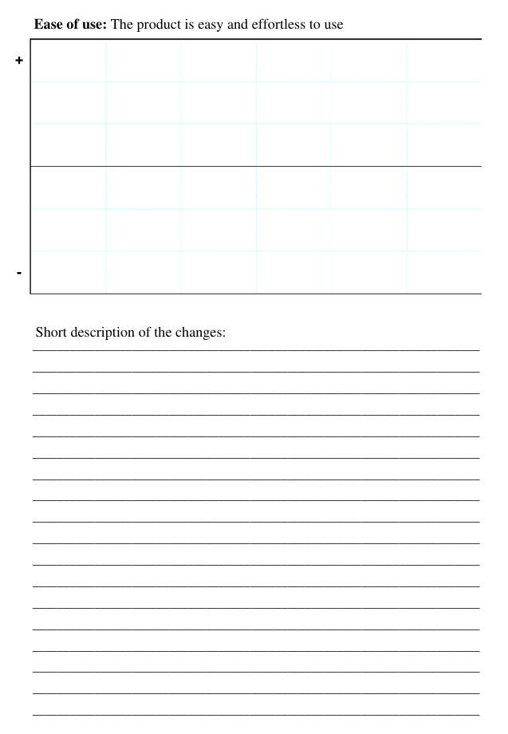
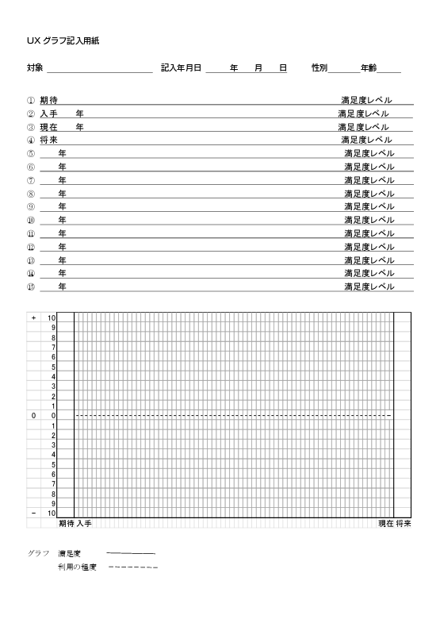

UXカーブを用いた
クチコミ支援ソフトウェアの実装

情報コース
久野公瑛

<time datetime="2019-12-07">2019/12/07</time>

---

タイトルを噛み砕くと…

1. **UXカーブ**というUX評価の手法を**応用**して
2. ユーザの**クチコミ**の記述を**支援**する
3. **ソフトウェア**を**実装**した

---

3\. 『ソフトウェアを実装した』

- 定めた要件をみたすソフトウェアの
    実装ができた
- ソフトウェアの有効性の評価は
    できなかった
- どのような実装なのか

---

2\. 『ユーザのクチコミの記述を支援する』

- クチコミとは
- なぜクチコミの記述に支援が必要か
- どのようにクチコミの記述を支援するのか

---

1\. 『UXカーブというUX評価の手法を応用して』

- UXとは
- UX評価とは
- UXカーブとは
- なぜUXカーブなのか

---

クチコミとは

> うわさ・評判などを口伝えに広めること。「口コミで売れる」
> 
> [補説]マスコミをもじった語。
> 1960年代の初めに使われだした。

<small>出典：[goo国語辞書「口コミ」の項目](https://dictionary.goo.ne.jp/word/%E5%8F%A3%E3%82%B3%E3%83%9F/)</small>

---

クチコミとは

近年ではオンラインでの製品・サービスに関するクチコミが増えている

- SNS
- ブログ
- ショッピングサイト

本研究で扱う対象

---

クチコミとは

例:

> 喜んでくれました
> :star::star::star::star::star:
> 父の誕生日プレゼントに購入しましたが、使いやすいと好評です。
> カラーは赤を選びましたが光沢感があり綺麗です。説明書を読まなくても使い方が分かる程度には機能
> がシンプル…

---

なぜクチコミの記述に支援が必要か

有用なクチコミは
商品の評価の参考になる

---

なぜクチコミの記述に支援が必要か

1. クチコミには主観的な表現が用いられる傾向
2. 主観的な表現が多いクチコミは有用性が低い

主観的な表現だけでは、どんな商品なのか
評価することができない

<small>参考：[商品レビュー文における主観的表現と有用性に関する検討](https://ipsj.ixsq.nii.ac.jp/ej/?action=repository_uri&item_id=164274&file_id=1&file_no=1)</small>

---

どのようにしてクチコミの記述を支援するのか

商品の評価に役立つ内容が含まれるよう
主観的な表現以外の記述を促す

『主観的な表現以外の記述』とは？

---

UXとは

- **U**ser e**X**perience、ユーザ体験
- 一般的な概念としての経験の中でも、
    システムを通じた経験のこと
- 次のようなものに影響をうける
    - ユーザとシステムを取り巻く文脈
    - ユーザの状態
    - システムの特性

<small>参考：[UX白書(日本語版)](http://site.hcdvalue.org/docs)</small>

---

システムを利用している瞬間以外も
UXは形成されている

{: style="height: 400px;"}

<small>出典：[UX白書(日本語版)](http://site.hcdvalue.org/docs)</small>

---

システムを利用している瞬間以外も
UXは形成されている

<small>出典：[UX白書(日本語版)](http://site.hcdvalue.org/docs)</small>

---

『主観的な表現以外の記述』とは？

UXの定義を元に考えれば…

1. 製品・サービスの特性
2. ユーザの利用状況
    - だれが
    - いつ
    - どこで
    - なにを
    - なぜ
    - どうやって

どうやってこれらの記述を促す？

---

UX評価とは

- UXに当てはまる事象を評価する
- UXのどの期間に着目するかによって
    最適なアプローチは異なる
    - 利用前
    - 利用中
    - 利用後
    - 利用期間全体
---

UXカーブとは

横軸に時間、縦軸に魅力、使いやすさなどの
度合いをペンで描く

{: style="height: 300px;"}

<small>参考・出典：[UX Curve: A method for evaluating long-term user experience](https://doi.org/10.1016/j.intcom.2011.06.005)</small>

---

なぜUXカーブなのか

- 思い出しながら書くので、1回の入力で
    利用期間全体のUXが記述できる
- 利用した時期に意識を向けることができる
- 時系列の順序でUXが整理できる

---

UXカーブ

{: style="height: 500px;"}

---

UXグラフ

{: style="height: 500px;"}

---

まとめ
