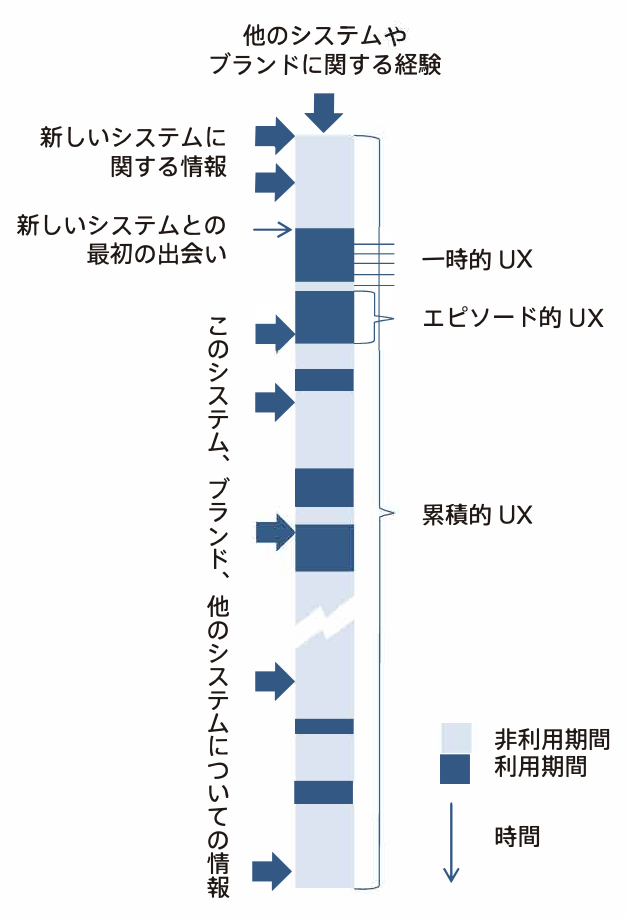
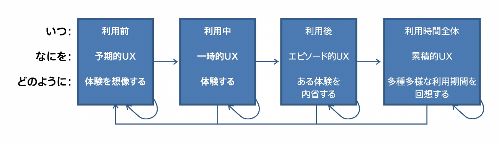
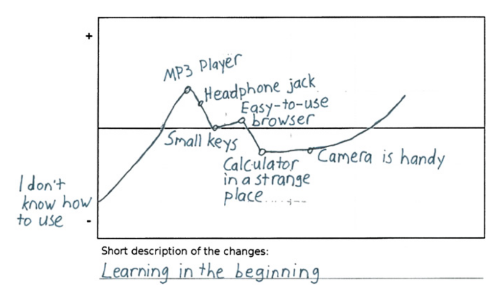

UXカーブを用いた
クチコミ支援ソフトウェアの実装

情報コース
久野公瑛

<time datetime="2019-12-07">2019/12/07</time>

---

タイトルを噛み砕くと…

1. **UXカーブ**というUX評価の手法を**応用**して
2. ユーザの**クチコミ**の記述を**支援**する
3. **ソフトウェア**を**実装**した

---

1\. 『UXカーブというUX評価の手法を応用して』

- UXとは
- UX評価とは
- UXカーブとは
- なぜUXカーブが必要か

---

2\. 『ユーザのクチコミの記述を支援する』

- クチコミとは
- なぜクチコミの記述に支援が必要か
- どのように支援するのか

---

3\. 『ソフトウェアを実装した』

- 定めた要件をみたすソフトウェアの
    実装ができた
- ソフトウェアの有効性の評価は
    できなかった

---

UXとは

- **U**ser e**X**perience、ユーザ体験
- 一般的な概念としての経験の中でも、
    システムを通じた経験のこと
- 次のようなものに影響をうける
    - ユーザとシステムを取り巻く文脈
    - ユーザの状態
    - システムの特性

<small>参考: [UX白書(日本語版)](http://site.hcdvalue.org/docs)</small>

---

システムを利用している瞬間以外も
UXは形成されている

{: style="height: 400px;"}

<small>出典: [UX白書(日本語版)](http://site.hcdvalue.org/docs)</small>

---

システムを利用している瞬間以外も
UXは形成されている

<small>出典: [UX白書(日本語版)](http://site.hcdvalue.org/docs)</small>

---

UX評価とは

- UXに当てはまる事象を評価する
- UXのどの期間に着目するかによって
    最適なアプローチは異なる
    - 利用前
    - 利用中
    - 利用後
    - 利用期間全体
---

UXカーブとは

横軸に時間、縦軸に魅力、使いやすさなどの
度合いをペンで描く

{: style="height: 300px;"}

<small>参考・出典: [UX Curve: A method for evaluating long-term user experience](https://doi.org/10.1016/j.intcom.2011.06.005)</small>

---

なぜUXカーブが必要か

- 思い出しながら書くので、1回の入力で
    利用期間全体のUXが記録できる
- 時系列の順序でUXが表現できる

---

クチコミ(口コミ)とは

> うわさ・評判などを口伝えに広めること。
> 
> [補説]マスコミをもじった語。
> 1960年代の初めに使われだした。

<small>出典: [goo国語辞書](https://dictionary.goo.ne.jp/word/%E5%8F%A3%E3%82%B3%E3%83%9F/)</small>

---

クチコミとは

---

なぜクチコミの記述に支援が必要か

---

まとめ
